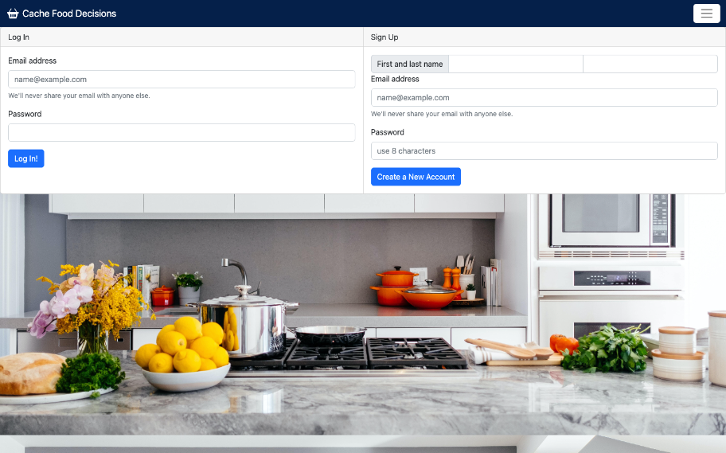
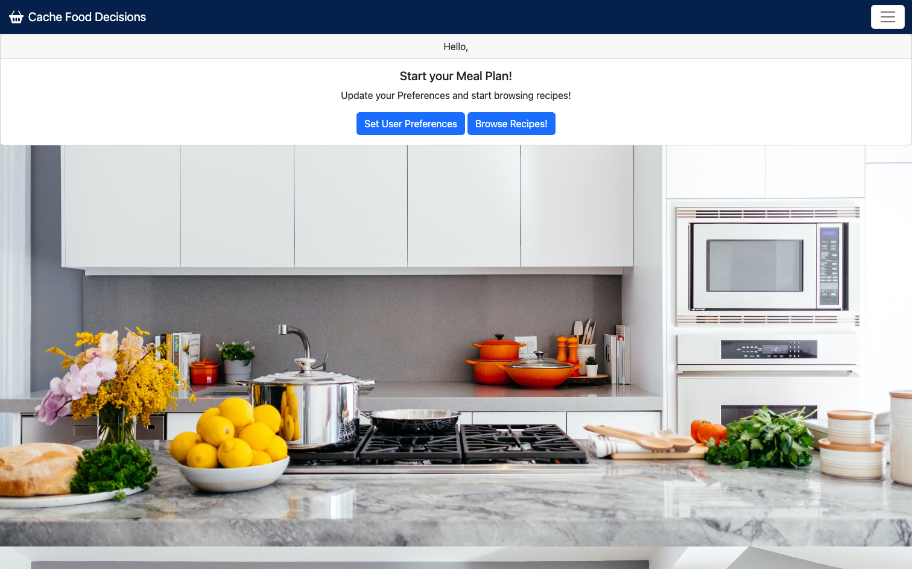
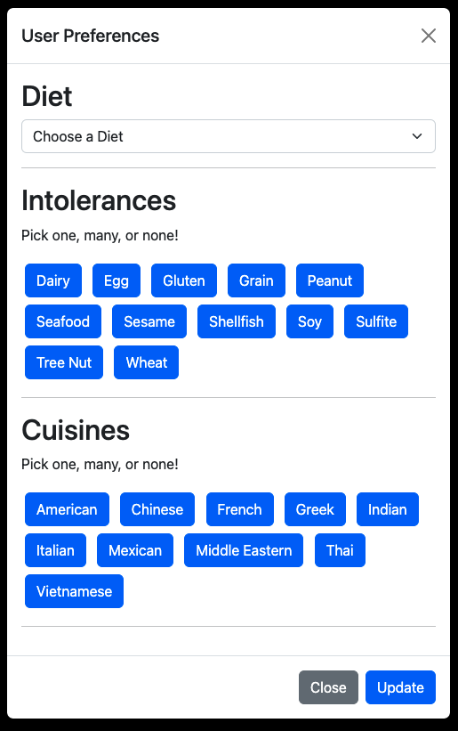

# Cache-Food-Decisions

[](https://opensource.org/licenses/MIT)

## Description

This app provides a way to organize a busy person's life. It gives the user choices on diet, allergies, and types of food, creates a page with recipe cards the user may select from which the ingredients are then pushed to a shopping list. The list will allow the user to look through ingredients they already own and not purchase something they already have. The app uses a MYSQL database for the recipes and user preferences, is written in Javascript and uses Node.js, Express.js, Sequelize, and is deployed using Heroku. The app keeps user settings secure with bcrypt and keeps their information throught the use of cookies.


## User Story

```md
AS an insanely busy person,
I WANT to streamline my meal prep
SO THAT I can enjoy what little free time I have.

```

<details>
<summary><strong>Table of Contents</strong></summary>

  - [Description](#description)
  - [User Story](#user-story)
  - [Installation](#installation)
  - [Usage](#usage)
  - [License](#license)
  - [Contributing Guidelines](#contributing-guidelines)
  - [Tests](#tests)
  - [Languages, Skills and Credits](#languages-skills-and-credits)
  - [Screenshots](#screenshots)
  - [Questions and Links](#questions-and-links)
</details>


## Installation 
```
- Clone the repository
- Run npm init and then npm install
- Add your MySQL credentials to the .env file
- Run the schema.sql from db/
- Seed the database using: npm run seed

```

## Usage
From the root directory, type in 'node index.js' or 'npm run start'


## License
Distributed under the **MIT** license.

## Contributing Guidelines
Contributions help our open source community to continue to evolve, and any contributions are greatly appreciated. If you have a suggestion that would improve this code please follow the directions below. I require that any and all changes adhere to the Code of Conduct outlined in the [Contributor Covenant](https://www.contributor-covenant.org/).

## Tests
There are currently no tests written for this application.

## Languages, Skills and Credits
- Javascript
- Node.js
- [Express](https://www.npmjs.com/package/express) is the webserver framework for Node.js.
- [Sequelize](https://www.npmjs.com/package/sequelize) is used to execute SQL code and CRUD operations.
- [MYSQL2](https://www.npmjs.com/package/mysql2) is used to initialize the database.
- [dotenv](https://www.npmjs.com/package/dotenv) is used to host credentials in the environment file. 
- [nodemailer](https://www.npmjs.com/package/nodemailer) is used to push the ingredient list to the user's email.
- [Bootstrap](https://getbootstrap.com/)is used to design the layout and look of the app.
- [bcrypt](https://www.npmjs.com/package/bcrypt) is used to hash passwords.

## Screenshots
  
  
  


## Questions Links
Github repository for [Cache Food Decisions](https://github.com/VictorMendez96/cache-food-decisions)

Contact the creators: [Victor Mendez](https://github.com/VictorMendez96), [Brisco Arechederra](https://github.com/brisco13), [Chris Williams](https://github.com/deftonechris), and [Anne Linger](https://github.com/amccorkl)

